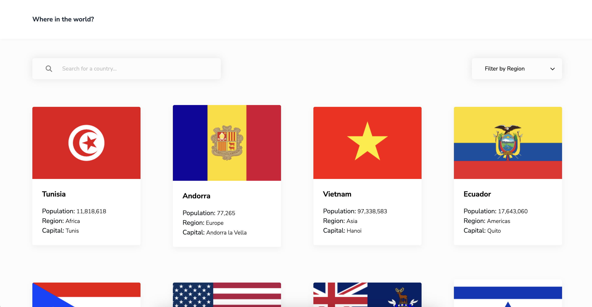

# REST Countries API

This project is a web application that consumes the REST Countries API and displays a list of countries. It also allows the user to search for countries by name or region and displays more detailed information about a selected country. The web application is built using React and TypeScript.

## Table of contents

- [Overview](#overview)
  - [The challenge](#the-challenge)
  - [Screenshot](#screenshot)
  - [Links](#links)
- [Built with](#built-with)
- [Author](#author)

## Overview

### The challenge

Users should be able to:

- See all countries from the API on the homepage
- Search for a country using an `input` field
- Filter countries by region
- Click on a country to see more detailed information on a separate page
- Click through to the border countries on the detail page
<!-- - Toggle the color scheme between light and dark mode -->

### Screenshot

### Links

- Live Site URL: [https://countries-api-azure-delta.vercel.app/](https://countries-api-azure-delta.vercel.app/)

## Built with

- Semantic HTML5 markup
- Mobile-first workflow
- Flexbox
- [REST Countries](https://restcountries.com/) - REST Countries API
- [TypeScript](https://www.typescriptlang.org/) - Strongly typed javascript
- [TailwindCSS](https://https://tailwindcss.com/) - For styles
- [React](https://reactjs.org/) - JS framework
- [React Router](https://reactrouter.com/home) - Multi-strategy router
- [Tanstack Query](https://tanstack.com/query/latest) - Asynchronous state management
- [Axios](https://axios-http.com/) - Promise based HTTP client

## Author

- Website - [Add website](https://www.your-site.com)
- Linkedin - [Gabriel Marcano](https://www.linkedin.com/in/gabriel-e-marcano/)

This is a solution to the [REST Countries API with color theme switcher challenge on Frontend Mentor](https://www.frontendmentor.io/challenges/rest-countries-api-with-color-theme-switcher-5cacc469fec04111f7b848ca).
